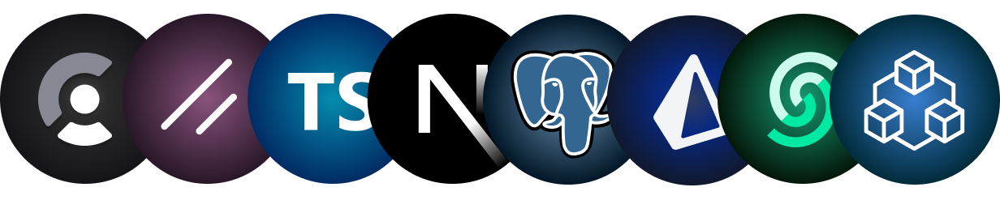
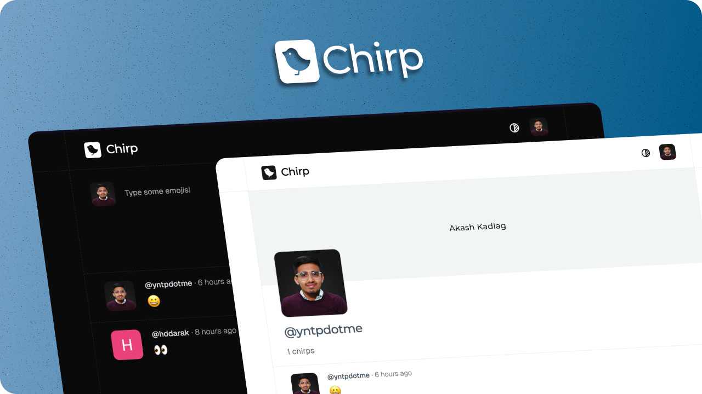

<h1 align="center">Chirp</h1>

<p align="center">
The Emoji-Only Social Network built for Gen-Z.
</p>

<p align=center>
  
<p>

<div align= "center">

[](https://twitter.com/yntpdotme)&nbsp;&nbsp;[](https://www.linkedin.com/in/yntpdotme/)&nbsp;&nbsp;[](mailto:hello@yntp.me)
&nbsp;[](https://conventionalcommits.org)&nbsp; [](https://choosealicense.com/licenses/mit/)

</div>

</div>

<h2 align="center">

 &nbsp;[See it in Action](https://chirp-yntp.vercel.app) &nbsp;»

</h2>

<br>

<p align="center">
  <a href="#introduction"><strong>Introduction</strong></a>
	·&nbsp;<a href="#features"><strong>Features</strong></a>
	·&nbsp;<a href="#tech-stack"><strong>Tech Stack</strong></a>
	·&nbsp;<a href="#local-development"><strong>Development Setup</strong></a>
	·&nbsp;<a href="#local-development"><strong>Contributing</strong></a>
</p>

<br>

## <a name="introduction">❄️&nbsp;Introduction</a>

Chirp is the emoji-only social app where vibes speak louder than words. No texts, no captions — just pure emotion in every post. Chirp lets you react, express, and connect without saying a thing. Say it all. Just Chirp it.

<br>

<a href="https://chirp-yntp.vercel.app/">
  <p align=center>
    
  <p>
</a>

<br>

## <a name="features">🔋&nbsp; Features</a>

- &nbsp;📦&nbsp;&nbsp; End-to-End TypeSafe APIs

- &nbsp;🎚️&nbsp;&nbsp; Rate Limiting per user

- &nbsp;🗃️&nbsp;&nbsp; Organized File and Folder Structure

- &nbsp;🔑&nbsp;&nbsp; Secure Authentication with OAuth Providers (Google & GitHub)

- &nbsp;📱&nbsp;&nbsp; Fully Responsive Design optimized for all devices

- &nbsp;☾&nbsp;&nbsp; Light and Dark Mode

<br>

## <a name="tech-stack">⚙️&nbsp; Tech Stack</a>

- [tRPC](https://trpc.io/) - TypeSafe RPC

- [Next.js](https://nextjs.org/) – React Framework

- [Upstash](https://upstash.com/) - Rate Limiting

- [ShadCN UI](https://ui.shadcn.com/) – Component library

- [Tailwind CSS](https://tailwindcss.com/) – CSS

- [TypeScript](https://www.typescriptlang.org/) - TypeSafe JavaScript

- [Zod](https://zod.dev/) - Schema Declaration & Validation Library

- [Postgres](https://www.postgresql.org/) - Database

- [Prisma](https://prisma.io/) – ORM

- [Clerk](https://clerk.com/) – Authentication

- [Git](https://git-scm.com) – Versioning

- [Vercel](https://vercel.com) – Deployments

<br>

## <a name="local-development"> 🖥️&nbsp;&nbsp; Local Development</a>

0.  **Prerequisites**

    Make sure you have the following installed on your machine:
    - [Git](https://git-scm.com/)
    - [Node.js](https://nodejs.org/en) (v20+)
    - [Docker](https://www.docker.com/)
    - [bun](https://bun.sh/) (As a Package Manager)

1.  **Clone the repository:**

    ```bash
    git clone https://github.com/yntpdotme/chirp.git
    ```

2.  **Navigate to the project directory:**

    ```bash
    cd chirp
    ```

3.  **Install dependencies:**

    ```bash
    bun install
    ```

4.  **Add Environment Variables:**

    Create `.env` file in the root folder and copy paste the content of `.env.sample`

    ```bash
    cp .env.sample .env
    ```

    Update credentials in `.env` with your credentials.

5.  **Setup Database**

    Start Postgres with Docker

    ```bash
    ./start-database.sh
    ```

6.  **Start the App:**

    ```bash
    bun dev
    ```

    Visit &nbsp;[http://localhost:3000](http://localhost:3000)&nbsp; to access your app.

<br>

## 🤝&nbsp;&nbsp;Contributing

Contributions are always welcome!

See [CONTRIBUTING.md](./CONTRIBUTING.md) for ways to get started.
</br></br>

## 🪪&nbsp;&nbsp; License

Chirp is open-source under the [MIT License](./LICENSE).
Feel free to learn, add upon, and share!
